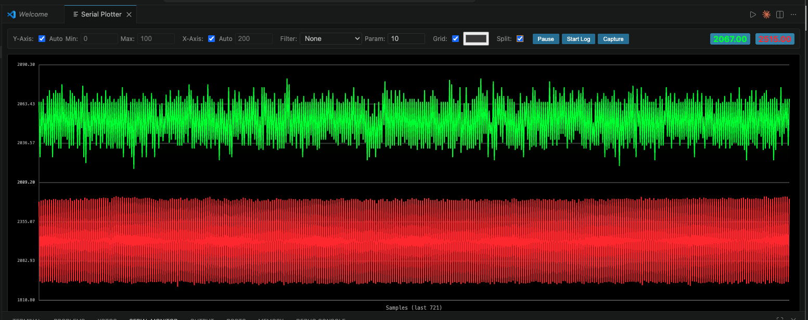

# SerialPlot Extension

A powerful, real-time Serial Plotter for VS Code. Visualize your serial data with ease, apply digital filters, and capture plots for your documentation.


## Features

- **Real-time Plotting**: High-performance visualization of serial data stream.
- **Multi-Stream Support**: Plot multiple values simultaneously using comma, semicolon, or space delimiters.
- **Split View**: Toggle between a single combined chart or separate charts for each data stream.
- **Data Logging**: Save real-time serial data to a CSV file for later analysis.
- **Pause/Resume**: Freeze the plot to inspect data without stopping the serial connection.
- **Theme Integration**: Automatically matches your VS Code theme (Colors, Fonts, and UI style).
- **Axis Values & Labels**: Automatic and manual Y-axis scaling with clear numeric labels.
- **Advanced Filtering**:
  - **Smooth (SMA)**: Simple Moving Average filter to reduce noise.
  - **Low Pass**: First-order IIR filter for high-frequency noise suppression.
  - **High Pass**: First-order IIR filter to focus on rapid changes in data.
- **Customizable Grid**: Toggle and color-customize the plot grid.
- **Data Capture**: Save high-quality PNG snapshots of your current plot.
- **Flexible Configuration**: Adjust baud rates, sampling points, and filter parameters on the fly.

## How to Use

1. **Connect your Device**: Ensure your serial device (Arduino, ESP32, etc.) is connected to your computer.
2. **Launch the Plotter**:
   - Press `F1` or `Ctrl+Shift+P` to open the Command Palette.
   - Type `Open Serial Plotter` and press Enter.
3. **Select Connection**:
   - Choose the serial port your device is connected to.
   - Select the desired baud rate (default is 9600).
4. **Interact with the Plot**:
   - Use the **Pause** button to freeze the view.
   - Use the **Start Log** button to record data to a CSV file.
   - Toggle **Split** to see channels in separate charts.
   - Use the **Filter** dropdown to apply real-time smoothing.
   - Toggle **Auto Y-Axis** to switch between automatic scaling and fixed ranges.
   - Click **Capture** to save the current view as an image.

## Arduino Example

To plot multiple data streams, simply print your values separated by commas and end the line with a newline character.

```cpp
void setup() {
  Serial.begin(9600);
}

void loop() {
  // Generate some sample data
  float sine = 50.0 * sin(millis() / 500.0);
  float cosine = 50.0 * cos(millis() / 500.0);
  int sensorValue = analogRead(A0);

  // Send data to Serial Plotter
  // Format: value1,value2,value3...
  Serial.print(sine);
  Serial.print(",");
  Serial.print(cosine);
  Serial.print(",");
  Serial.println(sensorValue);

  delay(20); // Update at ~50Hz
}
```

## Screen shot



## Requirements

- **Serial Port Access**: Ensure you have the necessary permissions to access serial ports on your operating system.
- **Data Format**: The extension expects numeric data sent over serial, ending with a newline character (`\n`). Multiple values can be separated by commas (`,`), semicolons (`;`), or spaces.

## Release Notes

### 0.0.4

- Added **Data Logging** functionality (CSV export).
- Refined UI layout and control grouping.

### 0.0.3

- Added **Pause/Resume** functionality.
- Added **VS Code Theme Integration** (Native look and feel).
- Improved UI responsiveness and button styling.

### 0.0.2

- Added **Multi-Stream Support**: Plot multiple variables simultaneously.
- Added **Split View** mode for individual channel visualization.
- Improved chart synchronization with **Right-Alignment**.
- Added Arduino example code.

### 0.0.1

- Initial release.
- Real-time plotting with Y-axis values.
- Implemented Smooth, Low Pass, and High Pass filtering.
- Added plot capture functionality.

---

**Developed with ❤️ by Chatchai Buekban**
